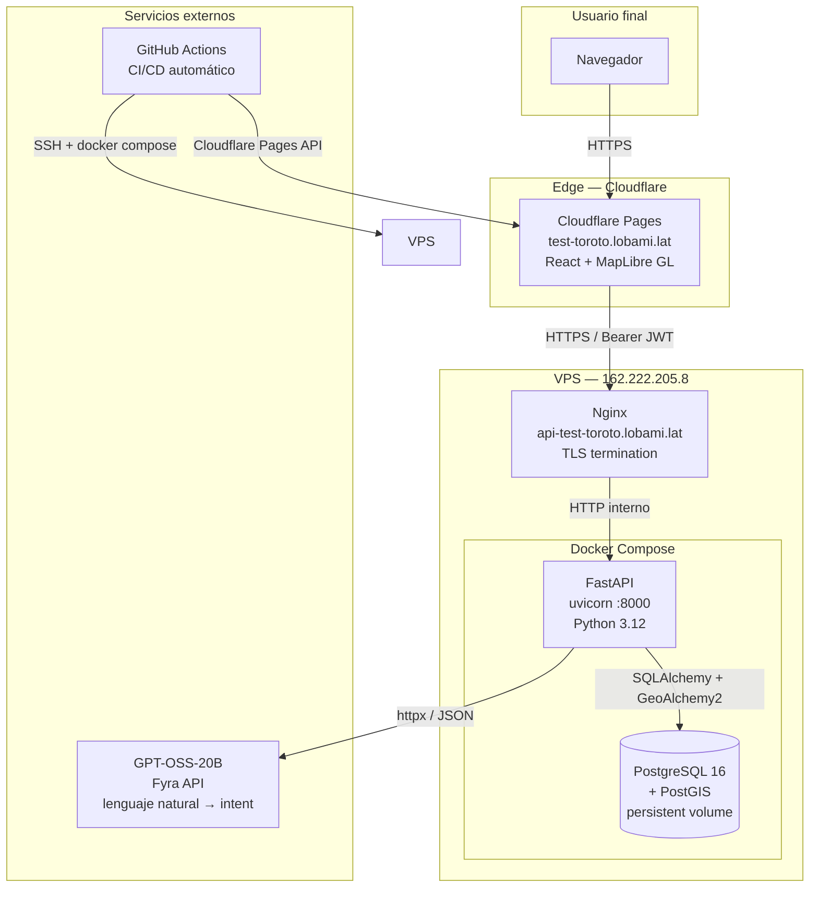
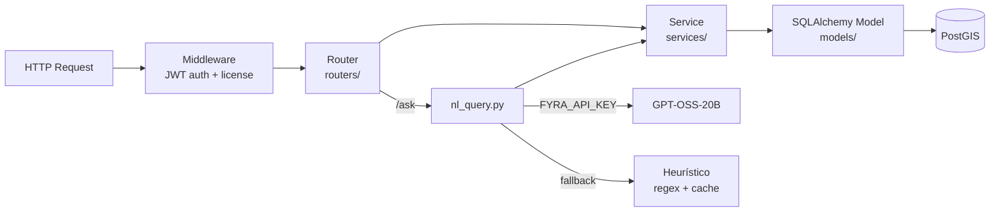
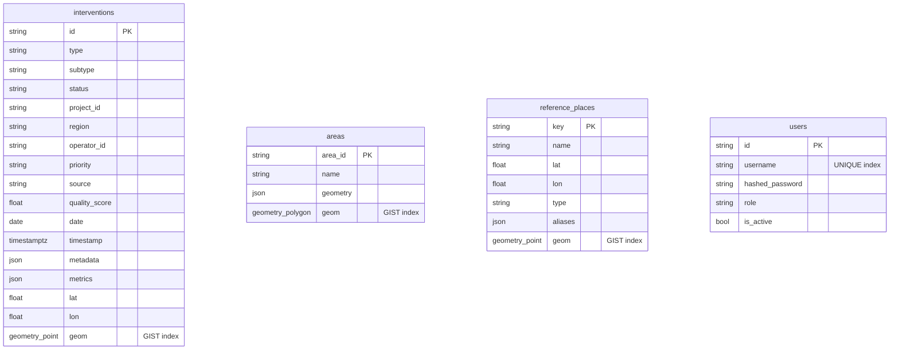
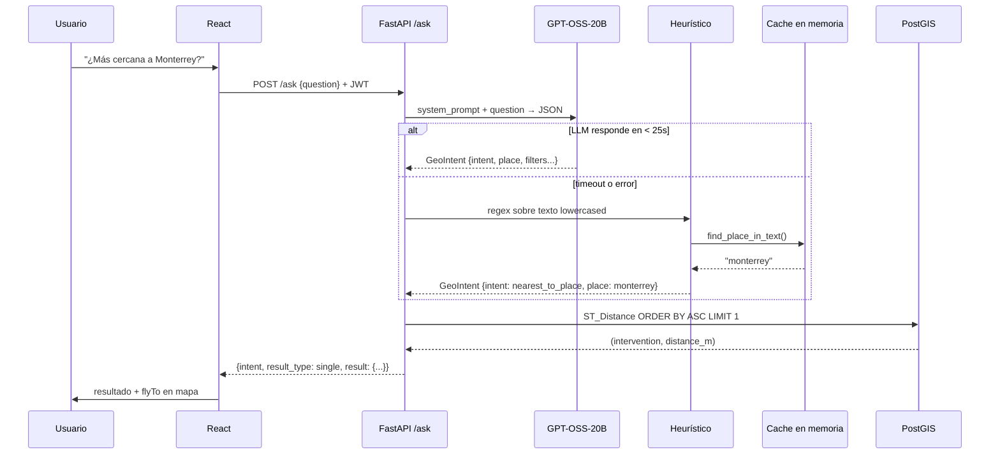
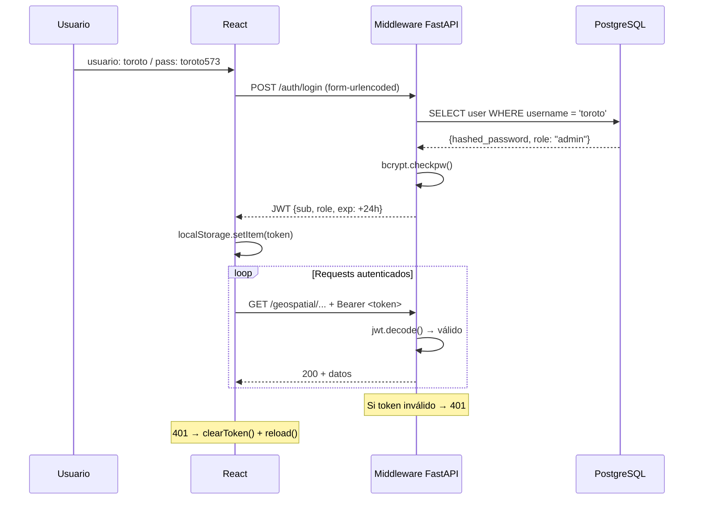
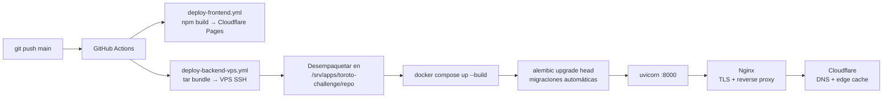
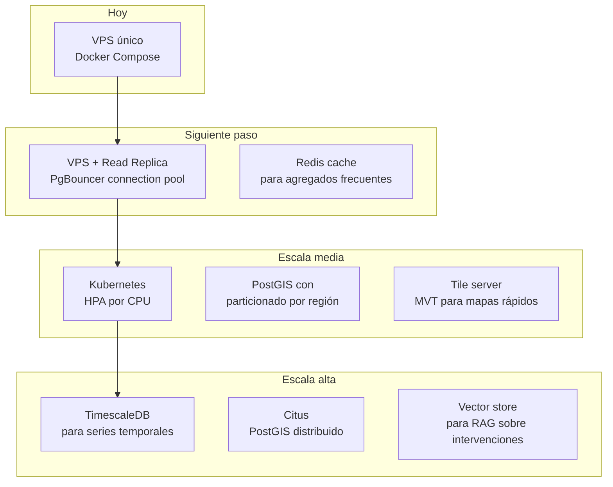

# Informe Técnico — Plataforma Geoespacial Toroto

**Prueba Técnica Software Engineer 2026**

| | |
|---|---|
| **Demo** | https://test-toroto.lobami.lat |
| **Usuario** | `toroto` |
| **Contraseña** | `toroto573` |
| **Repo** | https://github.com/lobami/toroto-challenge |

---

## Tabla de contenido

1. [Visto bueno vs requerimientos](#1-visto-bueno-vs-requerimientos)
2. [Arquitectura general](#2-arquitectura-general)
3. [Modelo de base de datos](#3-modelo-de-base-de-datos)
4. [Consultas geoespaciales](#4-consultas-geoespaciales)
5. [Capa de IA — diseño e implementación](#5-capa-de-ia--diseño-e-implementación)
6. [Autenticación y roles](#6-autenticación-y-roles)
7. [Infraestructura y deploy](#7-infraestructura-y-deploy)
8. [Trade-offs y decisiones clave](#8-trade-offs-y-decisiones-clave)
9. [Limitaciones actuales](#9-limitaciones-actuales)
10. [Evolución futura](#10-evolución-futura)

---

## 1. Visto bueno vs requerimientos

| Requerimiento | Estado | Detalle |
|---|---|---|
| Almacenar registros con coordenadas | ✅ | PostGIS `POINT` + lat/lon + GeoJSON |
| Consultar estado de los datos | ✅ | `/geospatial/summary`, filtros por status |
| Historial | ✅ | Campos `date` y `timestamp`, filtros por mes/año |
| Diseñado para escalar | ✅ | GIST indexes, cache en memoria, separación por capas |
| Nearest neighbor | ✅ | `ST_Distance` + `ORDER BY ASC LIMIT 1` |
| Within radius | ✅ | `ST_DWithin` con cast a Geography (metros reales) |
| Within area / polígono | ✅ | `ST_Within` contra polígonos de `areas` |
| Corrección geoespacial | ✅ | Geography casting — distancias geodésicas, no euclidianas |
| Separación almacenamiento / lógica | ✅ | `models/` → `services/` → `routers/` |
| Capa de IA (solo diseño pedido) | ✅+ | **Implementada y funcionando en producción** |
| PostGIS *(bonus)* | ✅ | PostgreSQL 16 + PostGIS, GeoAlchemy2 |
| Geometrías complejas GeoJSON *(bonus)* | ✅ | Polígonos de áreas en GeoJSON + WKT para PostGIS |
| Indexación espacial *(bonus)* | ✅ | `CREATE INDEX ... USING GIST` en todas las geometrías |
| Visualización en mapa *(bonus)* | ✅ | MapLibre GL con capas de puntos y polígonos |
| Ejemplos de uso sobre el dataset *(bonus)* | ✅ | 7 sample queries interactivos en la UI |

---

## 2. Arquitectura general



### Capas internas de la API



---

## 3. Modelo de base de datos



### Por qué esta estructura

**`interventions`** almacena la columna `geom` como `POINT` con SRID 4326 además de `lat`/`lon` en float. Los floats son útiles para serialización rápida a JSON; la geometría PostGIS es la fuente de verdad para todas las operaciones espaciales.

**`reference_places`** es el catálogo de lugares de referencia (28 estados + 23 ciudades principales de México). Se carga en un cache en memoria al startup, lo que elimina round-trips a DB en el path caliente del parser heurístico.

**`areas`** guarda los polígonos como GeoJSON (para servir al frontend directamente) y como geometría PostGIS (para `ST_Within`).

### Indexación espacial

Todas las geometrías tienen índice GIST:

```sql
CREATE INDEX idx_interventions_geom  ON interventions  USING GIST (geom);
CREATE INDEX idx_reference_places_geom ON reference_places USING GIST (geom);
CREATE INDEX idx_areas_geom          ON areas          USING GIST (geom);
```

Los índices GIST usan R-trees internamente — O(log n) para búsquedas espaciales vs O(n) sin índice.

---

## 4. Consultas geoespaciales

### 4.1 Nearest neighbor

**Pregunta:** "¿Cuál intervención está más cerca de Monterrey?"

**Flujo:**
```
GeoIntent{intent: nearest_to_place, place: "monterrey"}
  → get_reference_place("monterrey") → lat: 25.686, lon: -100.316
  → ST_Distance ordenado ASC LIMIT 1
```

**SQL generado (simplificado):**
```sql
SELECT i.*,
       ST_Distance(
           i.geom::geography,
           ST_SetSRID(ST_MakePoint(-100.316, 25.686), 4326)::geography
       ) AS distance_m
FROM interventions i
ORDER BY distance_m ASC
LIMIT 1;
```

**Por qué `::geography`:** El cast a tipo `geography` hace que PostGIS calcule distancias sobre el elipsoide WGS84 (metros reales), no sobre el plano cartesiano. Para México, la diferencia puede ser de varios km si se usa geometría plana.

**Resultado:** `{ intervention: {...}, distance_km: 14.084, reference_place: { name: "Monterrey" } }`

---

### 4.2 Within radius

**Pregunta:** "¿Intervenciones en 5 km de 20.700, -103.320 en marzo 2026?"

```sql
SELECT i.*,
       ST_Distance(i.geom::geography, point::geography) AS distance_m
FROM interventions i
WHERE ST_DWithin(
    i.geom::geography,
    ST_SetSRID(ST_MakePoint(-103.320, 20.700), 4326)::geography,
    5000  -- metros
)
AND EXTRACT(month FROM i.date) = 3
AND EXTRACT(year  FROM i.date) = 2026
ORDER BY distance_m ASC;
```

**`ST_DWithin` con Geography** usa el índice GIST eficientemente — solo evalúa candidatos dentro del bounding box esférico antes de calcular la distancia exacta.

---

### 4.3 Within area (polígono)

**Pregunta:** "¿Cuántas intervenciones están dentro de zone_c?"

```sql
SELECT i.*
FROM interventions i
JOIN areas a ON a.area_id = 'zone_c'
WHERE ST_Within(i.geom, a.geom);
```

**`ST_Within`** verifica que el punto esté completamente dentro del polígono. Usa índice GIST en ambas columnas para filtrar candidatos primero con bounding boxes, luego aplica la verificación exacta.

**Nota:** Se usa `geom` (no `geography`) en `ST_Within` porque los polígonos son pequeños y la diferencia plana/esférica es despreciable. `ST_DWithin` se usa con geography para distancias.

---

### 4.4 Farthest from place

**Pregunta:** "¿Cuál intervención está más lejos de Cancún?"

```sql
SELECT i.*,
       ST_Distance(i.geom::geography, cancun_point::geography) AS distance_m
FROM interventions i
ORDER BY distance_m DESC
LIMIT 1;
```

El mismo mecanismo que nearest, pero ordenando `DESC`. Sin índice espacial esto sería O(n) — aceptable porque devuelve 1 fila y n=~1000.

---

### 4.5 Count by region (agregado)

```sql
SELECT region, COUNT(id) AS count
FROM interventions
GROUP BY region
ORDER BY count DESC;
```

Consulta tabular clásica, sin operaciones espaciales. Útil para dashboards operativos.

---

## 5. Capa de IA — diseño e implementación

### Arquitectura del flujo NL → resultado



### Estructura de GeoIntent

```json
{
  "intent": "nearest_to_place",
  "lat": null,
  "lon": null,
  "place": "monterrey",
  "radius_km": null,
  "area_id": null,
  "start_date": null,
  "end_date": null,
  "project_id": null,
  "status": "validated",
  "subtype": null,
  "region": null,
  "explanation": "Buscando la intervención más cercana a Monterrey con estado validada."
}
```

### Por qué funciones predefinidas y no SQL por LLM

| Enfoque | Costo | Latencia | Precisión | Riesgo |
|---|---|---|---|---|
| **SQL por LLM** | Medio | Alta (2-5s) | Inestable — alucinaciones de schema | **Inyección SQL**, joins incorrectos |
| **Funciones predefinidas + LLM para intent** | Bajo | Media (1-3s) | Alta — SQL siempre correcto | Ninguno |
| RAG sobre documentos | Alto | Alta | Media — depende del retrieval | Complejidad operativa |

**Decisión:** El LLM solo extrae intención y parámetros (JSON estructurado). Nunca toca SQL. La API traduce el intent a una query PostGIS determinística. Esto hace el sistema auditable, testeable y libre de inyección.

### Heurístico como fallback

El heurístico garantiza que el sistema funcione incluso sin API key o con el LLM caído:

```
texto → normalizar (sin tildes, lowercase)
      → detectar intent ("cerca", "lejos", "radio", "zona")
      → detectar lugar (cache en memoria de reference_places)
      → detectar filtros (regex: proj_\d+, status keywords, subtypes)
      → construir GeoIntent
```

Cubre el 90% de las consultas frecuentes con latencia < 1ms adicional.

---

## 6. Autenticación y roles



**Roles:** `admin` (acceso total), `viewer` (read-only — mismos endpoints actuales, diferenciación para extensión futura).

**Seguridad:** Passwords con bcrypt (factor de costo por defecto ~12 rondas). JWT HS256 con `JWT_SECRET` generado aleatoriamente y almacenado en GitHub Secrets, nunca en el repo.

---

## 7. Infraestructura y deploy



### Separación seed vs deploy

```
deploy normal (cada push):
  alembic upgrade head → uvicorn
  → migraciones corren, datos NO se tocan

seed (solo primer deploy o reset intencional):
  docker cp dataset.json → container
  python scripts/load_dataset.py
  → borra e inserta todo desde JSON
```

Esta separación evita que un deploy accidental borre datos de producción.

### Variables de entorno (nunca en repo)

```
DATABASE_URL        → GitHub Secret → .env.production en VPS
JWT_SECRET          → GitHub Secret → .env.production en VPS
FYRA_API_KEY        → GitHub Secret → .env.production en VPS
ALLOWED_ORIGINS     → GitHub Secret → Cloudflare Pages env
VITE_API_URL        → GitHub Secret → Cloudflare Pages env
```

---

## 8. Trade-offs y decisiones clave

### PostgreSQL + PostGIS vs alternativas

| | PostGIS | MongoDB Atlas | BigQuery Geo |
|---|---|---|---|
| Costo | Gratis (self-hosted) | $$$ | Pay-per-query |
| Consultas espaciales | ST_* nativo, maduro | Limitado | Bueno pero lento |
| SQL + JSON | ✅ | No SQL | ✅ |
| Operaciones | VPS propio | Managed | Serverless |
| **Elección** | ✅ Mejor relación control/costo/poder ||

### Cache en memoria para reference_places

Los lugares de referencia (51 filas) se cargan en un dict al startup. El heurístico los consulta sin DB round-trip en cada `/ask`. Trade-off: si se agregan lugares en DB sin reiniciar la API, no se reflejan hasta restart. Aceptable para este volumen y frecuencia de cambio.

### Heurístico antes que LLM (para el fallback)

El LLM se intenta primero si tiene API key. Si falla, el heurístico responde en < 1ms. Esto garantiza disponibilidad incluso con el LLM caído, sin degradar la experiencia visible del usuario.

### Geometría vs Geography en PostGIS

- `ST_Within` y operaciones de contención: `geometry` (plano, más rápido)
- `ST_Distance` y `ST_DWithin`: `geography` (elipsoide WGS84, metros reales)

Para México (latitud ~20°N), la distorsión cartesiana vs geodésica puede ser 0.3-0.5% — insignificante para polígonos pequeños, relevante para distancias >100km.

---

## 9. Limitaciones actuales

| Limitación | Impacto | Solución futura |
|---|---|---|
| Dataset sintético | Los datos no reflejan distribución real de intervenciones | Conectar ingesta real desde campo |
| Un solo nodo de DB | Sin HA, un corte baja el sistema | Read replica + PgBouncer |
| JWT sin refresh token | Sesión expira a las 24h, requiere re-login | Refresh token con rotación |
| Heurístico en español | No maneja inglés ni mezclas idiomáticas bien | Ampliar regex o usar NLP ligero |
| Sin paginación en `/interventions` | Carga completa (2000 registros) al inicio | Cursor pagination + streaming |

---

## 10. Evolución futura

### Escalabilidad de la plataforma



### Evolución de la capa de IA

**Corto plazo:** Ampliar intents — actualmente 6, podrían ser 15+ (por operador, por calidad, tendencias temporales).

**Mediano plazo:** RAG sobre historial de intervenciones — el LLM podría responder "¿qué proyectos tuvieron más problemas en Jalisco?" sin SQL hardcodeado.

**Largo plazo:** Agente autónomo con herramientas — el LLM llama funciones geoespaciales como tools, encadena múltiples queries, devuelve análisis narrativo.

### Independencia de proveedor de LLM

El sistema está diseñado para cambiar el LLM sin tocar la lógica:

```python
# config.py
fyra_base_url: str = "https://api.fyra.im/v1"  # compatible OpenAI
fyra_model: str = "gpt-oss-20b"
```

Cualquier API compatible con OpenAI (OpenRouter, Azure, Groq, Anthropic con adaptador) funciona cambiando solo las variables de entorno. El heurístico como fallback garantiza que un cambio de proveedor no rompa el servicio durante la transición.

---

## Apéndice — Stack completo

| Capa | Tecnología | Versión |
|---|---|---|
| Lenguaje backend | Python | 3.12 |
| Framework API | FastAPI | 0.116 |
| Servidor ASGI | uvicorn | 0.35 |
| ORM | SQLAlchemy | 2.0 |
| Extensión geoespacial ORM | GeoAlchemy2 | 0.17 |
| Base de datos | PostgreSQL | 16 |
| Extensión geoespacial BD | PostGIS | 3.x |
| Driver PostgreSQL | psycopg | 3.2 |
| Migraciones | Alembic | 1.16 |
| Validación | Pydantic v2 | 2.11 |
| Auth JWT | PyJWT | 2.10 |
| Hash passwords | bcrypt | 4.2 |
| HTTP client (LLM) | httpx | 0.28 |
| Frontend framework | React | 19 |
| Build tool frontend | Vite | 7 |
| Mapas | MapLibre GL | latest |
| Deploy frontend | Cloudflare Pages | - |
| Deploy backend | Docker Compose + Nginx | - |
| CI/CD | GitHub Actions | - |
| Dominio frontend | test-toroto.lobami.lat | - |
| Dominio API | api-test-toroto.lobami.lat | - |
| Modelo IA | GPT-OSS-20B (Fyra) | - |
